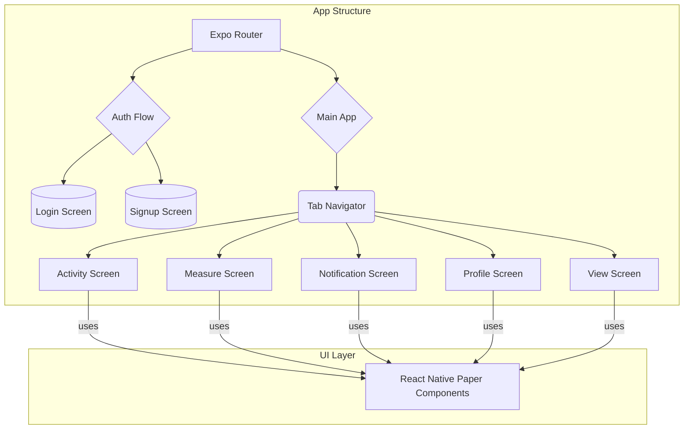

# Health Tracking Mobile App UI

## Project Aim
This project is a frontend template for a mobile health tracking application. It provides a complete, well-structured user interface for an app designed to monitor activity, take health measurements, and view user profiles.

## Technical Implementation
The application is built with **React Native** and the **Expo** framework, using **TypeScript** for a robust and maintainable codebase. It leverages **Expo Router** for file-based navigation, organizing the app into a main tabbed area and a separate authentication flow. The UI components are styled using **React Native Paper**, a library that implements Google's Material Design.

**Note:** This repository contains the frontend UI and navigation structure. It does not include a backend or a database implementation for data persistence.

## Key Features
- **Structured UI Components:** Well-organized folders for screens, components, styles, and constants.
- **Tab-Based Navigation:** Includes screens for Activity, Measurements, Notifications, and Profile.
- **Authentication Flow:** A separate `(auth)` route is set up to handle user login and registration screens.
- **Material Design:** Utilizes `react-native-paper` for a clean and modern user interface.

## Setup Instructions

- **Install dependencies:** `npm install`

- **Run the app:** `npx expo start`

## System Diagram

